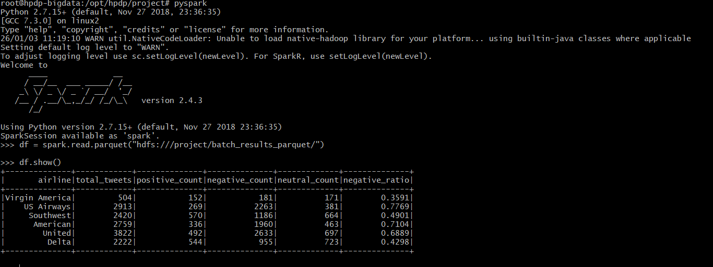
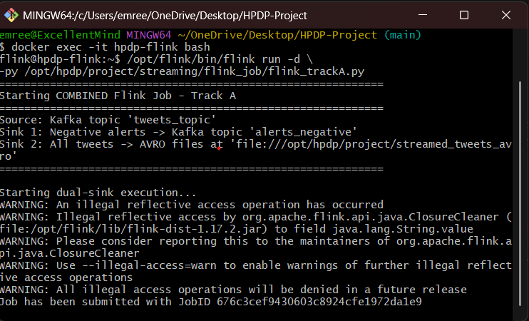
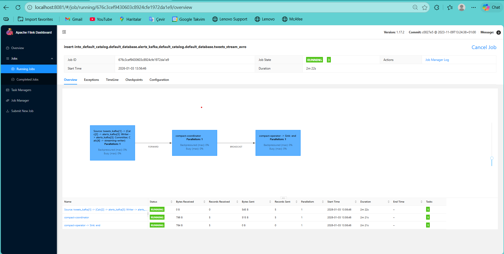
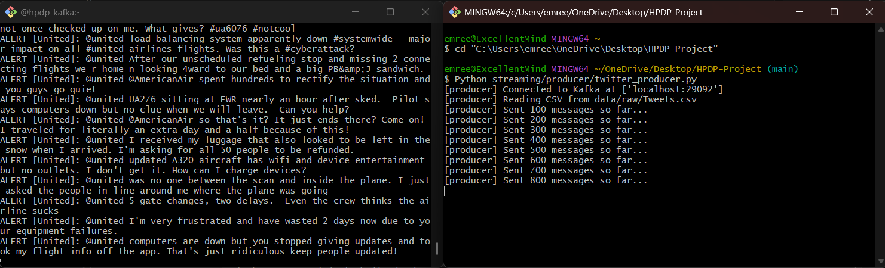
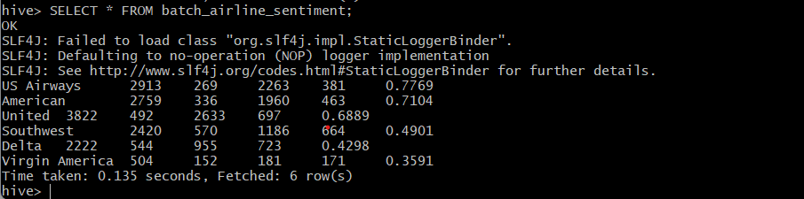
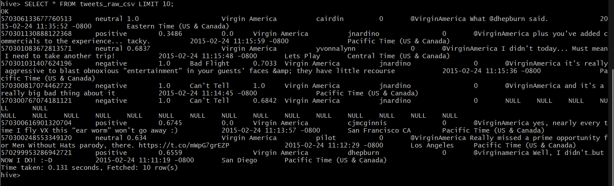
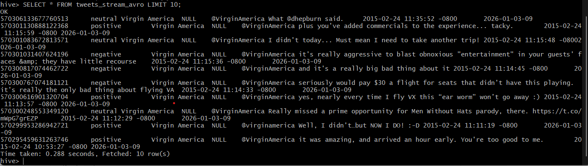

# Emre Efe Serin
# Distributed Sentiment-Analysis Pipeline

A distributed big data pipeline for batch and real-time sentiment analysis of Twitter airline data.

This project uses **Apache Spark**, **Apache Kafka**, **Apache Flink**, **Apache Hive**, and **HDFS** inside a Docker-based environment. It processes airline tweet sentiment data, calculates batch analytics, streams tweets through Kafka, detects negative sentiment in real time, and stores/query results through Hive.

## Features

- Batch sentiment analytics with Apache Spark
- Real-time tweet streaming with Apache Kafka
- Real-time negative complaint detection with Apache Flink
- Distributed storage with HDFS
- SQL-based querying with Apache Hive
- Dockerized big data environment
- Hive external tables for raw, streamed, and processed data
- Screenshot-based project results included in the repository

## Project Architecture

```text
                    +----------------------+
                    |   Tweets.csv Dataset |
                    +----------+-----------+
                               |
                               v
                    +----------------------+
                    |        HDFS          |
                    |   /project/raw       |
                    +----------+-----------+
                               |
                +--------------+--------------+
                |                             |
                v                             v
       +------------------+          +------------------+
       |  Apache Spark    |          | Kafka Producer   |
       |  Batch Job       |          | tweets_topic     |
       +--------+---------+          +--------+---------+
                |                             |
                v                             v
+------------------------------+     +------------------+
| Batch Analytics Output       |     | Apache Flink     |
| /project/batch_results...    |     | Streaming Job    |
+-------------+----------------+     +--------+---------+
              |                               |
              |                               v
              |              +-------------------------------+
              |              | Negative Alerts + Stream Data |
              |              | alerts_negative               |
              |              | streamed_tweets_avro          |
              |              +---------------+---------------+
              |                              |
              v                              v
            +------------------------------------+
            |            Apache Hive             |
            | Raw CSV + Streamed Data + Results  |
            +------------------------------------+
```

## Tech Stack

| Component | Purpose |
|---|---|
| Docker / Docker Compose | Containerized environment |
| HDFS | Distributed file storage |
| Apache Spark | Batch sentiment analytics |
| Apache Kafka | Real-time message streaming |
| Apache Flink | Real-time stream processing |
| Apache Hive | SQL query layer |
| Python | Producer and processing jobs |
| PySpark | Spark batch job implementation |
| PyFlink | Flink streaming job implementation |

## Repository Structure

```text
.
├── batch/
│   └── spark_job/
│       └── spark_batch_job.py
├── data/
│   └── raw/
│       └── Tweets.csv
├── hive/
│   └── ddl/
│       ├── 01_create_tweets_raw_csv.hql
│       ├── 02_create_tweets_stream_avro.hql
│       └── 03_create_batch_airline_sentiment.hql
├── infra/
│   └── flink/
│       ├── Dockerfile
│       └── start-flink.sh
├── streaming/
│   ├── flink_job/
│   │   └── flink_trackA.py
│   └── producer/
│       └── twitter_producer.py
├── Project_Photos/
│   ├── Bash_Alerts_Kafka.png
│   ├── batch_airline_sentiment-Hive.png
│   ├── Flink_Bash_Job_Submitted.png
│   ├── Project_Running_Flink_Dashboard.png
│   ├── Spark_Batch_Analytics.png
│   ├── tweets_raw_csv-Hive.png
│   └── tweets_stream_avro-Hive.png
├── docker-compose.yml
├── .gitignore
└── README.md
```

## Dataset

This project uses the **Twitter US Airline Sentiment** dataset.

Dataset source:

```text
https://www.kaggle.com/datasets/crowdflower/twitter-airline-sentiment
```

Place the dataset here:

```text
data/raw/Tweets.csv
```

The dataset is uploaded into HDFS at runtime:

```text
/project/raw/Tweets.csv
```

## Processing Workflow

### 1. Batch Processing

The Spark batch job reads the full tweet dataset from HDFS and calculates sentiment statistics for each airline.

The batch job produces:

- Positive tweet count
- Negative tweet count
- Neutral tweet count
- Negative sentiment ratio

Output path:

```text
/project/batch_results_parquet/
```

### 2. Stream Processing

The Kafka producer reads `Tweets.csv` row by row and sends tweet records to Kafka.

Kafka topic:

```text
tweets_topic
```

The Flink streaming job consumes tweets from Kafka, filters negative sentiment tweets, and generates complaint alerts.

Alert topic:

```text
alerts_negative
```

The stream output is partitioned by hour:

```text
dt=YYYY-MM-DD-HH
```

Stream output path:

```text
/project/streamed_tweets_avro/
```

### 3. Hive Query Layer

Hive external tables are used to query:

- Raw CSV tweet data
- Streamed tweet data
- Spark batch analytics results

Hive tables:

```text
tweets_raw_csv
tweets_stream_avro
batch_airline_sentiment
```

## Requirements

Make sure the following tools are installed:

- Docker Desktop or Docker Engine
- Docker Compose
- Python 3.8+
- Required Python packages:
  - kafka-python
  - pyflink
  - pyspark

Install Python dependencies:

```bash
pip install kafka-python pyflink pyspark
```

## Running the Project

### 1. Start Docker Containers

```bash
docker-compose up -d
```

Check running containers:

```bash
docker ps
```

Expected containers:

```text
hpdp-bigdata
hpdp-zookeeper
hpdp-kafka
hpdp-flink
```

## 2. Prepare HDFS

Enter the Big Data container:

```bash
docker exec -it hpdp-bigdata bash
```

Create HDFS directories:

```bash
hdfs dfs -mkdir -p \
  /project/raw \
  /project/streamed_tweets_avro \
  /project/batch_results_parquet
```

Upload the dataset to HDFS:

```bash
hdfs dfs -put /opt/hpdp/project/data/raw/Tweets.csv /project/raw/Tweets.csv
```

Verify the uploaded file:

```bash
hdfs dfs -ls -h /project/raw/
hdfs dfs -cat /project/raw/Tweets.csv | head -5
```

Exit the container:

```bash
exit
```

## 3. Create Kafka Topics

Create the tweet stream topic:

```bash
docker exec hpdp-kafka kafka-topics --create \
  --bootstrap-server localhost:9092 \
  --topic tweets_topic \
  --partitions 3 \
  --replication-factor 1 \
  --if-not-exists
```

Create the alert topic:

```bash
docker exec hpdp-kafka kafka-topics --create \
  --bootstrap-server localhost:9092 \
  --topic alerts_negative \
  --partitions 1 \
  --replication-factor 1 \
  --if-not-exists
```

List Kafka topics:

```bash
docker exec hpdp-kafka kafka-topics \
  --bootstrap-server localhost:9092 --list
```

## 4. Create Hive Tables

Create the raw CSV table:

```bash
docker exec hpdp-bigdata bash -c \
"cd /opt/hpdp/project && hive -f hive/ddl/01_create_tweets_raw_csv.hql"
```

Create the streamed tweets table:

```bash
docker exec hpdp-bigdata bash -c \
"cd /opt/hpdp/project && hive -f hive/ddl/02_create_tweets_stream_avro.hql"
```

Create the batch analytics table:

```bash
docker exec hpdp-bigdata bash -c \
"cd /opt/hpdp/project && hive -f hive/ddl/03_create_batch_airline_sentiment.hql"
```

## 5. Run Spark Batch Analytics

Enter the Big Data container:

```bash
docker exec -it hpdp-bigdata bash
```

Run the Spark job:

```bash
cd /opt/hpdp/project
spark-submit batch/spark_job/spark_batch_job.py
```

Check output:

```bash
hdfs dfs -ls -h /project/batch_results_parquet/
```

Optional PySpark check:

```bash
pyspark
```

```python
df = spark.read.parquet("hdfs:///project/batch_results_parquet/")
df.show()
df.printSchema()
df.orderBy(df.negative_ratio.desc()).show()
```

Exit:

```python
exit()
```

```bash
exit
```

## 6. Run Flink Streaming Job

Enter the Flink container:

```bash
docker exec -it hpdp-flink bash
```

List current Flink jobs:

```bash
/opt/flink/bin/flink list
```

Start the Flink job:

```bash
/opt/flink/bin/flink run -d \
-py /opt/hpdp/project/streaming/flink_job/flink_trackA.py
```

Check local stream output:

```bash
ls -lh /opt/hpdp/project/streamed_tweets_avro/
cat /opt/hpdp/project/streamed_tweets_avro/tweets-*.json | head -20
```

Exit the container:

```bash
exit
```

Flink dashboard:

```text
http://localhost:8081
```

## 7. Run Kafka Producer

From the host machine:

```bash
python streaming/producer/twitter_producer.py
```

This sends tweet records to Kafka and triggers the Flink streaming pipeline.

## 8. Copy Stream Output to HDFS

Flink writes stream output locally. To query the streamed output from Hive, copy it to HDFS.

Create an archive inside the Flink container:

```bash
docker exec hpdp-flink bash -c \
"cd /opt/hpdp/project/streamed_tweets_avro && tar czf /tmp/avro_files.tar.gz dt=*"
```

Copy archive from Flink container to host:

```bash
docker cp hpdp-flink:/tmp/avro_files.tar.gz ./avro_files.tar.gz
```

Copy archive from host to Big Data container:

```bash
docker cp ./avro_files.tar.gz hpdp-bigdata:/tmp/
```

Extract and upload to HDFS:

```bash
docker exec hpdp-bigdata bash -c \
"cd /tmp && tar xzf avro_files.tar.gz && hdfs dfs -put dt=* /project/streamed_tweets_avro/"
```

Repair Hive partitions:

```bash
docker exec hpdp-bigdata bash -c \
"hive -e 'MSCK REPAIR TABLE tweets_stream_avro;'"
```

## 9. Query with Hive

Enter the Big Data container:

```bash
docker exec -it hpdp-bigdata bash
```

Start Hive:

```bash
hive
```

Query raw tweets:

```sql
SELECT * FROM tweets_raw_csv LIMIT 10;
```

Query streamed tweets:

```sql
SELECT * FROM tweets_stream_avro LIMIT 10;
```

Query batch airline sentiment results:

```sql
SELECT * FROM batch_airline_sentiment;
```

## Results

### Spark Batch Analytics



### Flink Job Submission



### Flink Dashboard



### Kafka Negative Alerts



### Hive Batch Airline Sentiment Results



### Hive Raw CSV Table



### Hive Streamed Avro Table



## Example Output Paths

Raw dataset:

```text
/project/raw/Tweets.csv
```

Spark batch result:

```text
/project/batch_results_parquet/
```

Flink streamed output:

```text
/project/streamed_tweets_avro/
```

Kafka input topic:

```text
tweets_topic
```

Kafka alert topic:

```text
alerts_negative
```

## Notes

- Make sure Docker has enough memory allocated before starting the environment.
- If containers fail due to memory pressure, increase Docker memory limits or stop unnecessary applications.
- The streamed output must be copied to HDFS before querying it with Hive.
- If the Hive streamed table returns no results, run `MSCK REPAIR TABLE tweets_stream_avro;` again after uploading partitions.

## License

This project is for educational and portfolio purposes.
